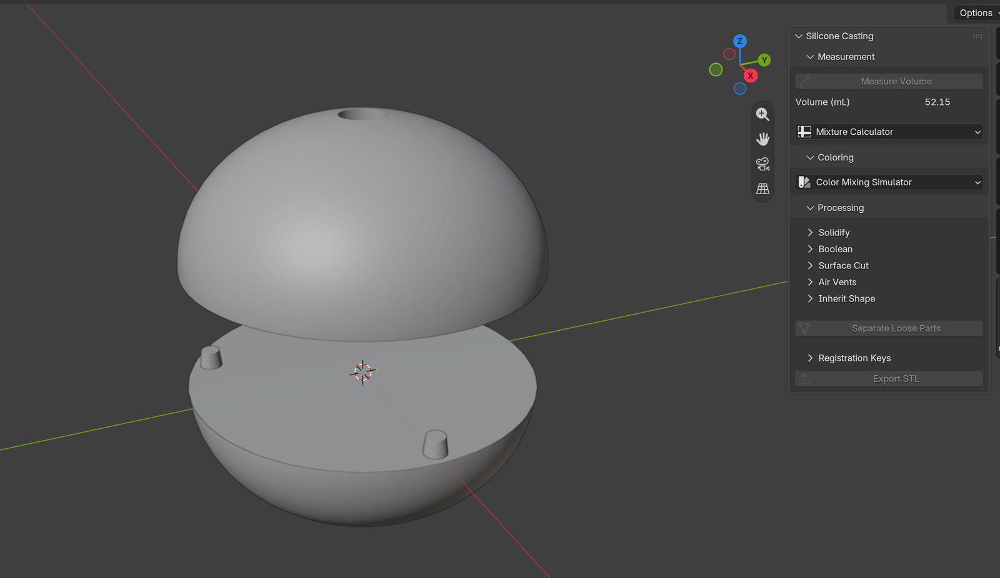
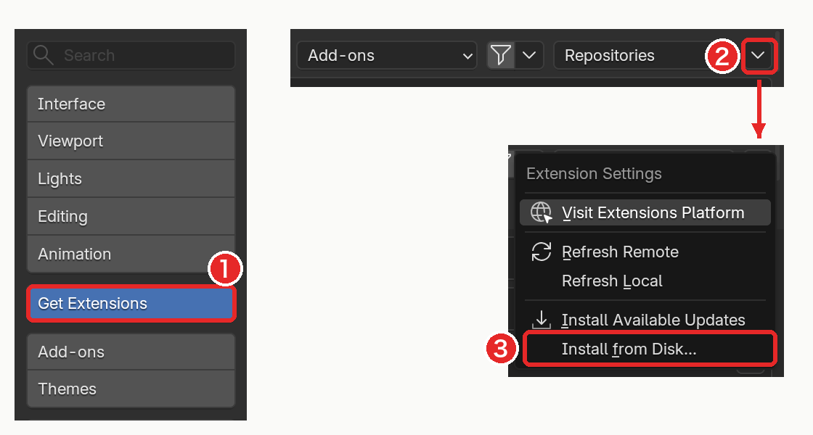
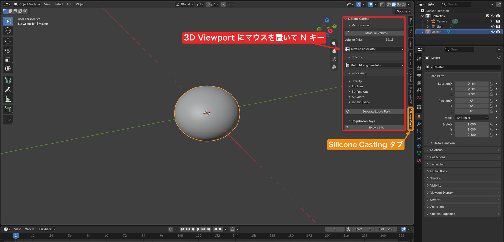
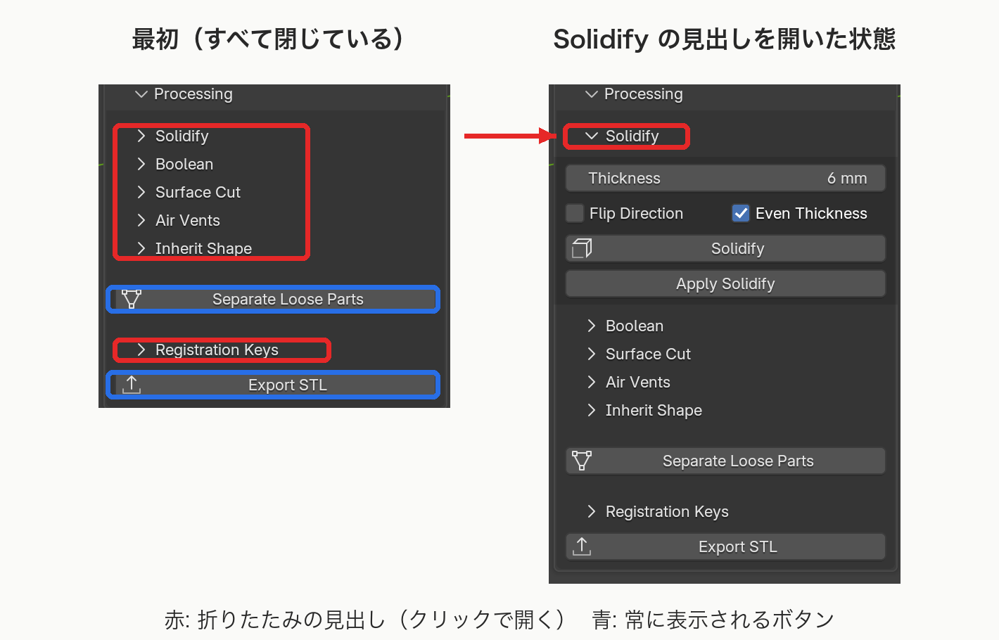

# Silicone Casting

シリコーン造形用の樹脂型（3D プリントできる分割型）を、マスターモデルから Blender 上で作るためのアドオンです。

マスターの外側に壁を付け、曲面で 2 つに割り、合わせ位置のダボと空気孔を開けて、mm 単位の STL として書き出すまでを、3D ビューのサイドバーから操作できます。シリコーンの必要量（体積）の計測、A 剤・B 剤の配合計算、着色のシミュレーションも同じ場所で行えます。

## 動作要件

- **Blender 5.1 以上**（Windows / macOS / Linux）
- Blender 5.0 以前には対応していません。5.0 以前の Blender では、インストールしようとしても非対応として受け付けられません。その場合は Blender を 5.1 以上に更新してください。

## インストール

1. [GitHub の Releases ページ](https://github.com/Geson-anko/silicone-casting/releases) から `silicone_casting-<バージョン>.zip` をダウンロードします。**zip は解凍しません。**
2. Blender で **Edit > Preferences** を開き、左の一覧から **Get Extensions** を選びます。
3. 右上の **∨**（下向き矢印）のメニューを開き、**Install from Disk...** を選んで、ダウンロードした zip を指定します（下の図の 1 → 2 → 3）。

インストールするとアドオンは有効になり、Preferences の **Add-ons** の一覧に **Silicone Casting** が表示されます。

このアドオンは、STL とレシピ JSON の読み書きにファイルアクセスを、計測値や色の値のコピーにクリップボードを使います（インストール時に表示される権限の説明はこの用途です）。

## 画面の場所

アドオンのボタンはすべて、3D Viewport のサイドバーにあります。

1. 3D Viewport の上にマウスを置いて **N** キーを押し、サイドバーを開きます。
2. サイドバー右端の縦のタブから **Silicone Casting** を選びます。

タブの中は 3 つのパネルに分かれています。

| パネル          | 内容                                                                       | ガイド                            |
| --------------- | -------------------------------------------------------------------------- | --------------------------------- |
| **Measurement** | 体積の計測（Measure Volume）と、A 剤・B 剤の配合計算（Mixture Calculator） | [計測と配合](docs/measurement.md) |
| **Coloring**    | 染料の混色シミュレーション（Color Mixing Simulator）                       | [着色](docs/coloring.md)          |
| **Processing**  | 型の形を作る処理（壁、Boolean、切断、空気孔、ダボ、分離、STL 出力）        | 下の一覧を参照                    |

### Processing は見出しを開いて使う

Processing の中の **Solidify / Boolean / Surface Cut / Air Vents / Inherit Shape / Registration Keys** は、それぞれ見出しだけが並んだ **折りたたみ** です。最初はすべて閉じているので、使う機能の見出し（左の ▸）をクリックして開くと、設定欄とボタンが表示されます。**Separate Loose Parts** と **Export STL** は折りたたまれておらず、常にボタンが見えています。

## 型づくりの流れ

典型的な手順は次のとおりです。各手順の詳しい操作と、「どのオブジェクトを選択・アクティブにするか」は [型づくりの流れ](docs/workflow.md) にまとめています。

1. マスターモデルを用意する（閉じたメッシュ）
2. マスターの体積を測り、シリコーンの配合と着色を決める
3. **Inherit Shape** でマスターの形を参照するオブジェクトを作り、**Solidify** で壁を付ける
4. 必要なら **Boolean** で注ぎ口などを加工する
5. **Surface Cut** で型を曲面で割る
6. **Separate Loose Parts** で割れた塊を別々のオブジェクトにする
7. **Registration Keys** で合わせ位置のダボを付ける
8. **Air Vents** で空気孔を開ける
9. **Export STL** でパーツごとに STL を書き出す

## ドキュメント

- [型づくりの流れ](docs/workflow.md) — 全体の順序と、各手順で選択するもの
- [計測と配合](docs/measurement.md) — Measure Volume、Mixture Calculator
- [着色](docs/coloring.md) — Color Mixing Simulator
- [壁と Boolean](docs/shell.md) — Inherit Shape、Solidify、Boolean
- [型の分割](docs/surface-cut.md) — Surface Cut、Draw Surface Cut、Edit Cutting Surface、Separate Loose Parts
- [ダボ](docs/registration-keys.md) — Registration Keys
- [空気孔](docs/air-vents.md) — Air Vents
- [STL 出力](docs/export-stl.md) — Export STL
- [レシピの保存と読み込み](docs/recipes-json.md) — 配合と色の JSON
- [単位の扱い](docs/units.md) — 長さ・体積・STL の単位

## ライセンス

GPL-3.0-or-later
