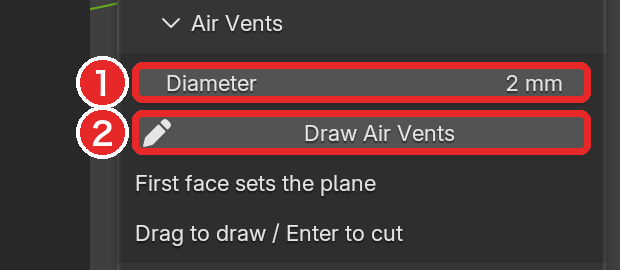
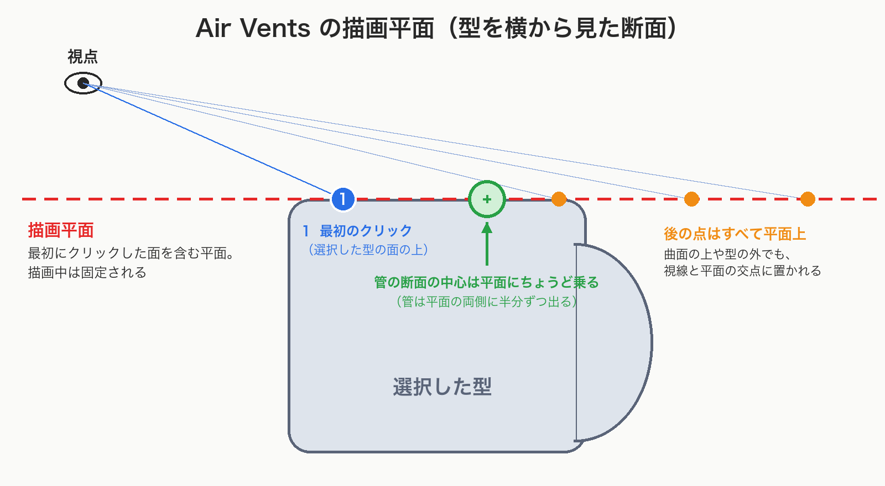
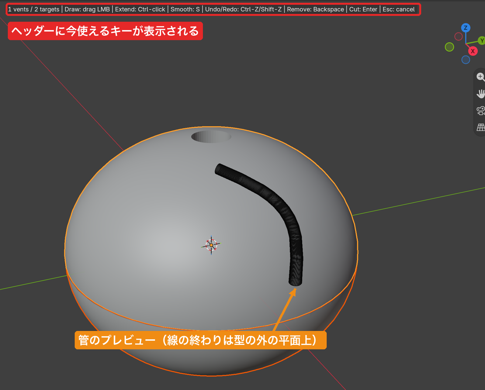

# 空気孔（Air Vents）

[README に戻る](../README.md)

## 📝 TL;DR

- 線を描くと、その線に沿った円い管ができます。管は、**選択した型すべて** からくり抜かれます
- 線は型の表面ではなく、**最初のクリックで決まる 1 枚の平面の上** に描きます
- 管の断面の中心は、**描画平面にちょうど乗ります**
- 急な曲がりで確定できないときは、**S で滑らかにするか、Diameter を小さく** しましょう
- 管のオブジェクトはシーンに残るので、**全選択での STL 出力には注意** です

## 🧭 どんな機能？

線を描いて、その線に沿った円い断面の管を作ります。

その管を、選択した型すべてからくり抜きます。

Processing パネルの **Air Vents** の見出しを開いて使います。

| 項目                   | 内容                                                                                                                                                 |
| ---------------------- | ---------------------------------------------------------------------------------------------------------------------------------------------------- |
| **Diameter**（図の 1） | 管の直径（既定 2 mm）。シーンの長さの単位で表示され、`2 mm` のように単位を付けて入れられます。描画中に変えると、プレビューがその場で太さを変えます。 |

## 🛠️ 始める

1. 空気孔を開けたい型を **すべて選択** します（Object Mode）。
2. **Draw Air Vents**（図の 2）を押します。

対象になるのは、描き始めた時点で選択されていたメッシュです。

描画中に選択を変えても、対象は変わりません。メッシュ以外は対象外です。

3D ビューを 4 分割表示（Quad View）にしていると、始められません。

Draw Surface Cut の描画中も、始められません。

## 📐 描画平面の決まり方

Air Vents の線は、型の表面ではなく **1 枚の平面の上** に描きます。

- 最初のクリックで、選択した型の面をクリックします。**クリックした点を通り、その面と平行な平面** が描画平面になります。平面はその後は変わりません。
- 型のないところをクリックしても、平面は決まりません。もう一度、型の面をクリックしましょう。
- その後に描く点はすべて、マウスの位置から画面の奥へ伸ばした線が **その平面と交わる点** に置かれます。
- マウスが別の面（曲面など）の上にあっても、その面には沿いません。型の外の何もない所でも、平面上に点が置かれます。
- 平面を真横から見ている（平面が視線とほぼ平行な）ときや、平面が視点より後ろにあるときは、点が追加されません。視点を回しましょう。

管は、断面の **中心が描画平面にちょうど乗る** ように作られます。中心は、平面から上にも下にもずれません。

そのため、管の半分は平面の片側に、残りの半分は反対側に出ます。

平らな面を最初にクリックした場合、管の中心はその面と同じ高さにあります。管は、その面に半分埋まった形になります。

## ⌨️ 描画中のキー

| キー                                               | 動作                                                           |
| -------------------------------------------------- | -------------------------------------------------------------- |
| 左ドラッグ                                         | 線を 1 本描く。ドラッグするたびに別の線（別の管）になります。  |
| **Ctrl** + 左クリック                              | 最後の線の端から、クリックした位置まで直線で延ばす             |
| **S**                                              | 最後の線の角を丸める（両端の位置は保つ）                       |
| **Backspace**                                      | 最後の線を消す                                                 |
| **Ctrl+Z** / **Ctrl+Shift+Z**（または **Ctrl+Y**） | 描画中の取り消し / やり直し（macOS では Cmd も使えます）       |
| **Enter**                                          | 確定して、対象の型をくり抜く                                   |
| **Esc**                                            | 取消。描いた線をすべて捨てて終了します。型は何も変わりません。 |

> ⚠️ **注意**: ヘッダーには `Undo/Redo: Ctrl-Z/Shift-Z` と表示されます。
> ですが、やり直しは **Ctrl+Shift+Z**（Ctrl と Shift を押しながら Z）です。Shift+Z だけでは何も起きません。

視点の操作と、**N** / **T** によるサイドバー・ツールバーの開閉は、描画中も使えます。

サイドバーの Diameter も、描画中に変えられます。

### 確定できないとき

線が急に折れ曲がっていて、その直径の管が作れないことがあります。

そのときはヘッダーにメッセージが出て、**Enter を押しても確定しません**。

- `Bend too tight: smooth the line or reduce Diameter`: 曲がりが直径に対して急すぎる
- `A vent cannot double back; smooth the bend`: 線が折り返している

対処は次のどれかです。

- **S** で線を滑らかにする
- **Diameter** を小さくする
- **Backspace** で線を消して描き直す

## ✅ 確定した後

- 描いたすべての管は、1 つのオブジェクトにまとめられます。名前は、描き始めたときに選択していた型のうち 1 つの名前に `.Air Vents` を付けたもの（例: `Mold.001.Air Vents`）です。
- このオブジェクトは、シーンに **ワイヤー表示で残ります**（レンダーには出ません）。
- 描き始めたときに選択していた型 **すべて** に、このオブジェクトを使う **Air Vents** という Boolean モディファイア（Difference、Exact）が付きます。
- 管のオブジェクトを編集・移動すると、空気孔もそれに合わせて変わります。
- 空気孔の追加全体は、**Ctrl+Z** で 1 回の操作として取り消せます。

> ⚠️ **注意**: 管のオブジェクトはシーンに残るので、全選択して Export STL を押すと STL に混ざります。
> 出力の前に、選択を確認しましょう。
