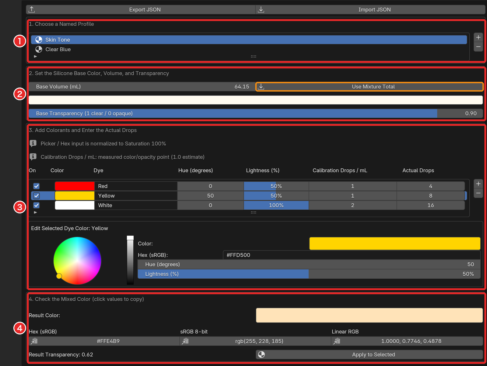
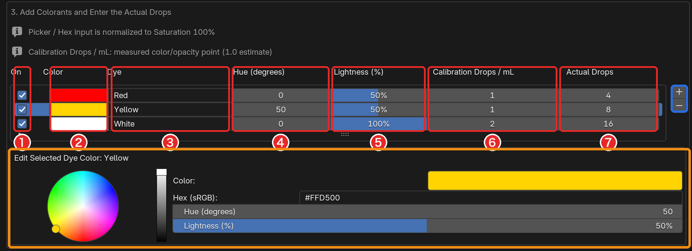
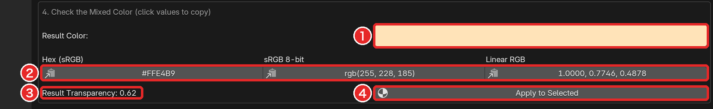

# 着色（Coloring）

[README に戻る](../README.md)

染料の種類と滴数から、仕上がりの色と透明度を予測する。

配色は名前付きの **プロファイル** として `.blend` に保存される。

## 🛠️ 入力

1〜4 の枠を上から順に入力する。

プロファイルを **−** で削除しても、適用済みのマテリアルは残る。

### ベースの設定

- **Base Volume (mL)**: 染料を混ぜるシリコーンの体積
- **Use Mixture Total**: Mixture Calculator の **Total**（Enabled がオンの行の合計）を Base Volume に入れる。Total が 0 ならエラーで何も変わらない
- **Base Transparency (1 clear / 0 opaque)**: 着色前の透明度

### Base Volume を変えると滴数も変わる

Base Volume を変えると、**すべての染料の Actual Drops が同じ倍率で変わる**（200 → 300 なら滴数も 1.5 倍）。

濃度は変わらないので、結果の色と透明度も変わらない。Use Mixture Total で変わったときも同じ。

> 💡 **ヒント**: 「この体積にこの滴数」を試すときは、**先に Base Volume を決めてから** Actual Drops を入れる。

### 染料

- **On**: オフの染料は計算に入らない
- **Lightness (%)**: 100% は白（他の色を淡くする）、0% は黒、その間は茶色のような暗めの色
- **Calibration Drops / mL**: その染料が **Color の色に見える濃度**（ベース 1 mL あたりの滴数）。既定の 1.0 は目安で、染料ごとに違う
- **Actual Drops**: 実際に入れる滴数（小数も可）

染料の色は **彩度 100% に固定** され、彩度の低い色を選んでも直される。

`#RRGGBB` 形式でない Hex 入力は無視され、前の色が残る。

例: シリコーン 50 mL に 25 滴入れて見えた色を Color に入れたなら、Calibration Drops / mL は 25 ÷ 50 = 0.5。

### 結果

色の値はクリックでコピーできる。

## 🧮 色と透明度の決まり方

計算に入るのは、**On がオンで、Actual Drops が 0 より大きい染料** だけ。

- **濃度** = Actual Drops ÷ (Base Volume × Calibration Drops / mL)。濃度 1 がちょうど Color の色になる濃さ
- **色**: ベースと各染料の反射スペクトルを、濃度を重みにして混ぜる減法混色の近似。ベースの重みは「1 − 濃度の合計」（0 未満にはならない）
- **透明度**: Result Transparency = Base Transparency × (1 − 濃度の合計)。濃度の合計が 1 以上なら 0（不透明）

> ⚠️ **注意**: **色に関係なく**、白を含めて、計算に入る染料はすべて透明度を下げる。

## 🖼 マテリアルへの適用

**Apply to Selected** は、選択中のメッシュにプロファイルのマテリアル `Silicone Mix - <プロファイル名>` を割り当てる（Object Mode）。

- マテリアルの枠がないメッシュ: 追加
- マテリアルがあるメッシュ: アクティブな枠を置き換え

色と透過（Transmission）は、プロファイルの編集に合わせてその場で更新される。

## 💾 保存と読み込み

**Import JSON** で読み込んだプロファイルは、今のリストに **追加** される（[レシピの保存と読み込み](recipes-json.md)）。
