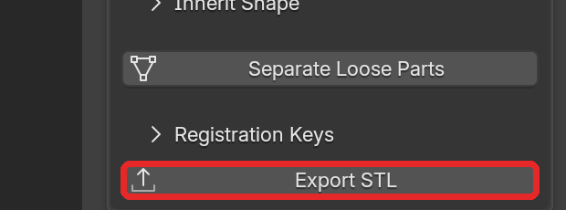
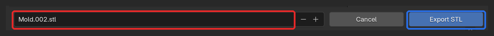

# STL 出力（Export STL）

[README に戻る](../README.md)

## 📝 TL;DR

- 書き出すのは **選択中のオブジェクトだけ** で、**モディファイアを適用した形** になる
- 長さは **mm** に換算される。既定の単位設定では座標が 1000 倍になる
- 選択したオブジェクトは、**すべて 1 つの STL ファイル** に入る
- パーツごとに分けるときは、**1 つずつ選んで** 書き出す

## 🧭 概要

選択したメッシュを、3D プリント用の STL ファイルとして書き出す。

Processing パネルの一番下にある、常に表示されたボタン。

## 🛠️ 手順

1. Object Mode で、書き出すメッシュを選択する。
2. **Export STL** を押す。ファイルブラウザが開く。
3. 保存先とファイル名を確認して、**Export STL**（ファイルブラウザ右下のボタン）を押す。拡張子 `.stl` は、省略しても付く。

### 最初に入っているファイル名と保存先

- ファイル名: **アクティブなオブジェクトの名前** + `.stl`。アクティブなオブジェクトが選択中のメッシュでないときは、選択中のメッシュのうちの 1 つの名前になる。
- 保存先: 最初は、保存済みの `.blend` があるフォルダ。一度書き出すと、同じ Blender を終了するまでは、**直前に書き出したフォルダ** が次の既定の保存先になる。

## 📦 書き出される内容

設定は固定で、次のとおりに書き出す。

- **選択中のオブジェクトだけ** を書き出す。
- **モディファイアを適用した形** で書き出す。元のオブジェクトは変わらない。
- 使われるのは、レンダー用の表示設定。モディファイア一覧のカメラのアイコンをオフにしたモディファイアは含まれない。
- 長さは **mm** に換算する。既定の単位設定（Unit Scale 1.0、Blender の 1 m が 1 単位）では、座標を 1000 倍して、Blender 上の 1 m を STL の 1000（mm）にする。
- Unit Scale を変えたシーンでも、Blender 上の実寸がそのまま mm で出力される（[単位の扱い](units.md)）。
- **選択したオブジェクトは、すべて 1 つの STL ファイルにまとめて** 入る。

> 💡 **ヒント**: スライサーでは mm として読み込む。

## 📂 パーツごとに書き出す

上の型と下の型を別々のファイルにするときは、1 つずつ選んで書き出す。

1. 1 つ目のパーツだけを選択して **Export STL**
2. 2 つ目のパーツだけを選択して **Export STL**（保存先は、1 つ目と同じフォルダになっている）

> ⚠️ **注意**: [Separate Loose Parts](surface-cut.md#-separate-loose-parts) の直後は、できたパーツがすべて選択されている。
> そのまま押すと、全パーツが 1 ファイルに入る。

## ⚠️ 選択に混ざりやすいもの

**A** キーで全選択すると、次のようなものも選択に入り、STL に混ざる。

- Boolean の **Operand** に使ったメッシュ
- Draw Surface Cut で作った切断面（`.Cutting Surface`）
- Air Vents の管（`.Air Vents`）

ダボの形のオブジェクトと、Separate Loose Parts で非表示になった元のオブジェクトは、非表示なので選択されない。
