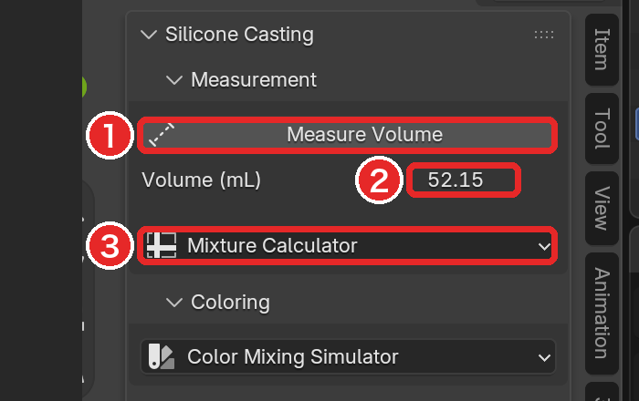
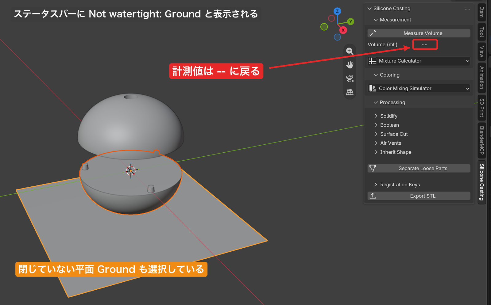
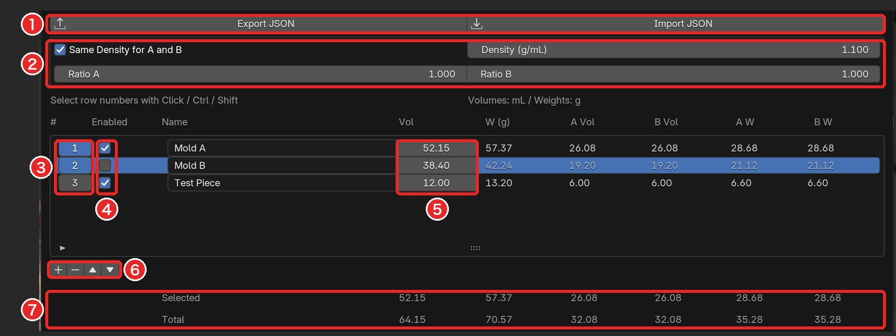

# 計測と配合（Measurement）

[README に戻る](../README.md)

## 📝 TL;DR

- **Measure Volume** は、選んだメッシュの体積を実寸の mL で合計します
- 表示は **押したときの値のまま** です。形を変えたら押し直しましょう
- 閉じていないメッシュが 1 つでも混ざると、数値は出ずに **`--`** に戻ります
- シリコーンの量は **マスター** を測ります。壁を測ると樹脂の量になります
- **Mixture Calculator** の Ratio は **重量比** です。Vol は手で入力します

## 🧭 パネルの中身

Measurement パネルでは、選択したメッシュの体積を測ります（**Measure Volume**）。

その体積から、A 剤・B 剤それぞれの量を計算します（**Mixture Calculator**）。

## 📏 Measure Volume

1. 測りたいメッシュを選択します（複数可）。
2. **Measure Volume**（図の 1）を押します。
3. 選択したメッシュの体積の **合計** が、**Volume (mL)** の右（図の 2）に表示されます。単位は mL（= cm³）です。

### 測られる体積

見た目どおりの実寸で測ります。

モディファイア（ビューポート表示がオンのもの）の結果と、オブジェクトの拡大縮小・回転を含みます。

たとえば、スケールを適用していないオブジェクトを各辺 1.5 倍に拡大すると、体積は 1.5³ 倍になります。

- ビューポート表示（モディファイア一覧のモニターのアイコン）をオフにしたモディファイアは含みません。
- カメラやライトなど、メッシュ以外のオブジェクトは、選択に入っていても無視されます。

### 表示は押したときの値のまま

表示される値は、**ボタンを押した瞬間の計測結果** です。

その後にモデルを変形・拡大したり、選択を変えたりしても、表示は自動では変わりません。

形を変えたら、もう一度 **Measure Volume** を押して測り直しましょう。

まだ一度も測っていないときは `--` と表示されます。

### 閉じていないメッシュが混ざっているとき

体積は、すき間のない閉じたメッシュにしか定義できません。

閉じたメッシュとは、すべての辺がちょうど 2 枚の面に共有されているメッシュのことです。

選択の中に閉じていないメッシュが **1 つでも** あると、次のようになります。

- 数値は出ません。閉じているメッシュの分だけの合計も出しません。
- ステータスバーに `Not watertight:` に続けて、原因のオブジェクト名が表示されます。4 つ以上ある場合は 3 つまで表示し、残りは件数で表示します。
- Volume (mL) の表示は、前の値ではなく `--` に戻ります。前の値が残っていると、今の選択の体積と誤解してしまうためです。

対処は 2 つです。

名前が出たオブジェクトを選択から外すか、そのメッシュの穴をふさぎましょう。

> 💡 **ヒント**: 穴の場所は、Edit Mode の **Select > Select All by Trait > Non Manifold** で確認できます。

よくある原因は、もともと閉じていない面です。

床として置いた平面や、Draw Surface Cut で作った切断面（`.Cutting Surface`）などがこれに当たります。

### 何を測るか

どのオブジェクトを選んで測るかで、得られる体積の意味が変わります。

| 選んで測るオブジェクト                          | 得られる体積                                     | 何の量か                                         |
| ----------------------------------------------- | ------------------------------------------------ | ------------------------------------------------ |
| **マスター**                                    | マスターの体積 = 型の中の空洞の体積              | 必要な **シリコーン** の量                       |
| Solidify で壁を付けたオブジェクト（`.inherit`） | 外側の面と内側の面にはさまれた **壁だけ** の体積 | 型を印刷する **樹脂** の量（シリコーンではない） |

シリコーンが入るのは型の中の空洞で、その形はマスターと同じです。

壁のオブジェクトの体積は、空洞を含みません。

Inherit Shape と Solidify の直後は、`.inherit`（壁）が選択されています。

シリコーンの量を測るときは、**マスターをクリックして選択し直してから** Measure Volume を押しましょう。

マスターを非表示にしている場合は、先に表示してから選択します。

> ⚠️ **注意**: マスターに直接 Solidify を付けると、マスターを測っても壁の体積になってしまいます。
> マスターはそのまま残し、[Inherit Shape](shell.md#-inherit-shape) で作ったオブジェクトに壁を付けましょう。

### 値をコピーする

表示された数値（図の 2）をクリックすると、その数値がクリップボードにコピーされます。

コピーされるのは、表示と同じ小数第 2 位までの数値だけです。単位や桁区切りは付きません。

表計算ソフトや、下の Mixture Calculator の **Vol** 欄にそのまま貼り付けられます。

> 💡 **ヒント**: Blender の数値欄は、マウスを乗せて **Ctrl+V** で貼り付けられます。

## 🧪 Mixture Calculator

**Mixture Calculator**（図の 3）を押すと、サイドバーの横に幅の広い計算表が開きます。

パーツ（型ごと、注型ごとなど）を 1 行ずつ入力します。

それぞれに必要な A 剤・B 剤の体積と重量が計算されます。

入力した内容と行の選択状態は、`.blend` に保存されます。

### 密度と比率を設定する（図の 2）

| 項目                         | 意味                                                                                                                                                                        |
| ---------------------------- | --------------------------------------------------------------------------------------------------------------------------------------------------------------------------- |
| **Same Density for A and B** | オンのとき、**Density (g/mL)** の 1 つの値を A 剤・B 剤の両方に使います。A 剤と B 剤の密度（比重）が違う場合はオフにして、**Density A** と **Density B** を別々に入れます。 |
| **Ratio A** / **Ratio B**    | A 剤と B 剤の **重量比** です。「100:10」なら 100 と 10、「10:1」なら 10 と 1 のように入れます（比が同じなら結果も同じです）。                                              |

比率は、体積比ではなく **重量比** として扱います。

製品の仕様書に体積比しか書かれていない場合は、体積比のそれぞれに密度を掛けて、重量比に直してから入れましょう。

### 行を入力する

表の各列は次のとおりです。体積は mL、重量は g です。

| 列                    | 内容                                                                                           |
| --------------------- | ---------------------------------------------------------------------------------------------- |
| **#**                 | 行番号。クリックで行を選択します（下の「行を選ぶ」）。                                         |
| **Enabled**           | オフにした行は計算表に残りますが、**合計にも小計にも入りません**（計算値は薄く表示されます）。 |
| **Name**              | パーツの名前。表の下の検索欄で名前による絞り込みができます。                                   |
| **Vol**               | そのパーツに使う、A 剤と B 剤を **混ぜた後の合計の体積**（mL）。手で入力します。               |
| **W (g)**             | 混ぜた後の合計の重量                                                                           |
| **A Vol** / **B Vol** | A 剤・B 剤それぞれの体積                                                                       |
| **A W** / **B W**     | A 剤・B 剤それぞれの重量（はかりで量る値）                                                     |

> ⚠️ **注意**: **Vol は Measure Volume の結果と連動しません。**
> 測った体積をクリックしてコピーし、Vol 欄に貼り付けましょう。
> 測り直したときも、貼り付け直す必要があります。

### 計算のしかた

A 剤と B 剤は、次の 2 つを満たすように分けられます。

- A 剤と B 剤の重量の比が、Ratio A : Ratio B になる
- A Vol と B Vol の和が、ちょうど Vol になる

A 剤・B 剤の体積は、それぞれ「重量 ÷ 密度」です。そのため、計算は次のようになります。

- 係数 k = Vol ÷ (Ratio A ÷ Density A + Ratio B ÷ Density B)
- A W = k × Ratio A、B W = k × Ratio B
- A Vol = A W ÷ Density A、B Vol = B W ÷ Density B、W (g) = A W + B W

表の値は、途中の k などを丸めずに計算してから、最後に小数第 2 位で表示したものです。

手計算で確かめるときも、途中で丸めると最後の桁がずれることがあります。

例を見てみましょう。

Same Density をオンにして、Density 1.10、Ratio 1 : 1、Vol 100 とします。

k = 100 ÷ (1/1.10 + 1/1.10) = 55 です。

なので、A W = B W = 55.00 g、W (g) = 110.00 g、A Vol = B Vol = 50.00 mL になります。

### 行を選ぶ・合計を見る

| 操作                                | 結果                                                              |
| ----------------------------------- | ----------------------------------------------------------------- |
| 行番号をクリック                    | その行だけを選択                                                  |
| **Ctrl** + 行番号をクリック         | その行の選択を切り替え（他の行の選択は保つ）                      |
| **Shift** + 行番号をクリック        | 最後に Shift なしでクリックした行から、その行までの範囲だけを選択 |
| **Ctrl + Shift** + 行番号をクリック | 範囲を今の選択に追加                                              |

表の下には、次の行が表示されます（図の 7）。

- **Selected**: 選択した行のうち、**Enabled がオンの行** の小計です。行を 1 つも選んでいないときは表示されません。
- **Total**: **Enabled がオンのすべての行** の合計です。選択とは関係ありません。

選択した行があるときは、**−**（削除）と **▲ / ▼**（1 行ずつ上下に移動）が押せるようになります。

**+** は、空の行を末尾に追加します（図の 6）。

### 着色に体積を渡す

Color Mixing Simulator の **Use Mixture Total** を押すと、ここの **Total** の体積がカラープロファイルの Base Volume に入ります。

Selected の小計ではないので気をつけましょう。

詳しくは [着色](coloring.md#2-%E3%82%B7%E3%83%AA%E3%82%B3%E3%83%BC%E3%83%B3%E3%81%AE%E3%83%99%E3%83%BC%E3%82%B9%E3%82%92%E8%A8%AD%E5%AE%9A%E3%81%99%E3%82%8B) を見てください。

### 保存と読み込み

図の 1 の **Export JSON** / **Import JSON** で、密度・比率とすべての行を JSON ファイルに保存したり、読み込んだりできます。

読み込むと、今の表は **置き換わります**。

詳しくは [レシピの保存と読み込み](recipes-json.md) を見てください。
