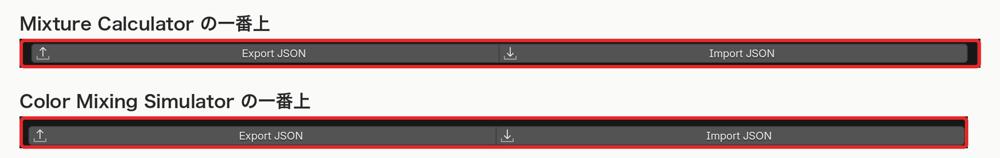

# レシピの保存と読み込み（JSON）

[README に戻る](../README.md)

Mixture Calculator の配合と、Color Mixing Simulator のカラープロファイルを JSON に書き出し、別の `.blend` で読み込む。

## 💾 保存されるもの

- **Mixture Calculator**: Same Density for A and B、Density A / B、Ratio A / B と、すべての行（Enabled、選択状態、Name、Vol）
- **Color Mixing Simulator**: すべてのプロファイル（名前、Base Volume、ベースの色、Base Transparency と、各染料の On、名前、Hue、Lightness、Calibration Drops / mL、Actual Drops）

計算結果と、オブジェクトに適用したマテリアルは入らない。読み込むと入力値から計算し直す。

## 📥 読み込み

- **Mixture Calculator**: 今の設定とすべての行が、ファイルの内容に **置き換わる**（今ある行は消える）
- **Color Mixing Simulator**: ファイルのプロファイルが、今のリストの末尾に **追加される**（今あるプロファイルは残る）。読み込んだ最後のプロファイルが選択される

## ⚠️ 読み込めないファイル

次のファイルは **何も変更せずに** 拒否し、`Unsupported recipe format, version, or type` などのエラーを出す。

- 種類が違うファイル（Mixture Calculator には配合のファイルだけ、Color Mixing Simulator にはカラーのファイルだけ）
- 古い形式（version 1）のファイル
- 項目の過不足、範囲外の値（負の体積など）、不正な文字を含むファイル

ファイル全体を確認してから反映するので、途中まで読み込まれることはない。
