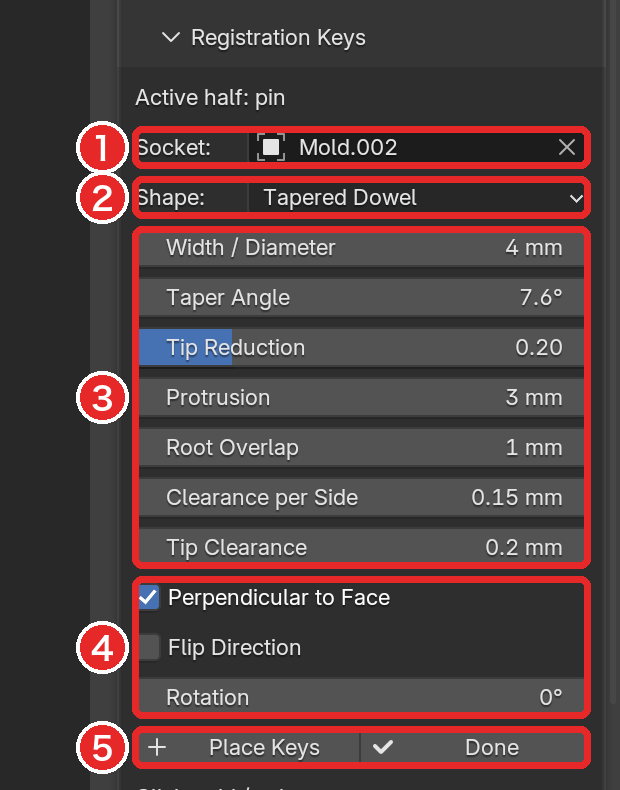
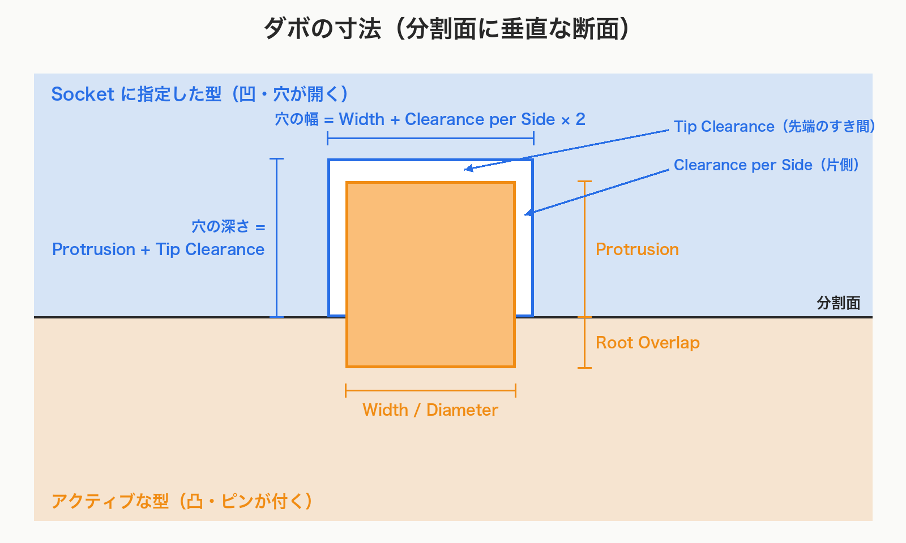
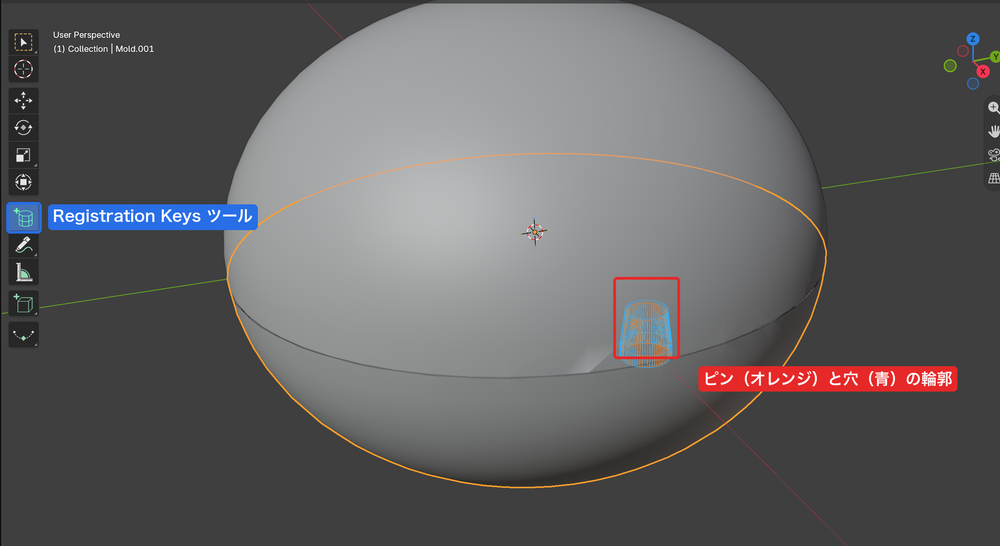
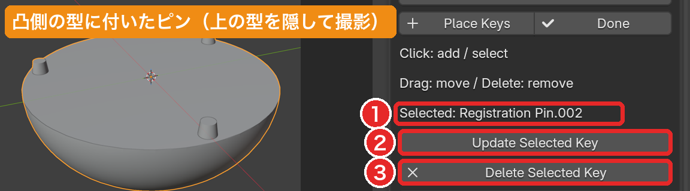

# ダボ（Registration Keys）

[README に戻る](../README.md)

割った型の合わせ面に、凸（ピン）と、それより少し大きい凹（穴）の組を付ける。

## 🛠️ 準備

ダボは **2 つの別々のオブジェクト** の間に付ける。

- 型は [Separate Loose Parts](surface-cut.md#-separate-loose-parts) で分けておく（Surface Cut だけでは 1 つのオブジェクトのまま）
- 両方の型を組み合わさった位置に置く。閉じていない型にも置けるが、置けない位置の検出は閉じた型でだけ働く

| できあがる形                 | その型の指定のしかた               |
| ---------------------------- | ---------------------------------- |
| ピン（凸）が **突き出す** 型 | クリックして **アクティブ** にする |
| 穴（凹）が **開く** 型       | **Socket** の欄で選ぶ              |

`Active half: pin` は「アクティブな型 = ピンが付く側」の意味。

**Socket**（受け口）は穴が開く側で、Socket の型にピンは付かない。

> ⚠️ **注意**: 逆に指定すると、ピンと穴の付く型が入れ替わる。アクティブにする型を先に決め、残りを Socket に選ぶ。

**Place Keys** は、Object Mode で、アクティブがメッシュ、**Socket** がアクティブとは別のメッシュのときだけ押せる。

## 📐 形と寸法

- **Round Dowel**: 円柱のピン
- **Tapered Dowel**（既定）: 先細りのピン。はめやすい
- **Rectangular Key**: 角形のキー。回り止めや、細長い凸と溝に

| 項目                                | 意味                                                                                                     | 既定値     |
| ----------------------------------- | -------------------------------------------------------------------------------------------------------- | ---------- |
| **Width / Diameter**                | ピンの幅（円柱なら直径）                                                                                 | 4 mm       |
| **Length**                          | 角形キーの長さ（Rectangular Key のみ）                                                                   | 8 mm       |
| **Taper Angle** / **Tip Reduction** | 先細りの角度と先端での幅の縮小率（Tapered Dowel のみ）。一方を変えるともう一方が変わる。縮小率は最大 90% | 縮小率 0.2 |
| **Protrusion**                      | ピンが分割面から突き出す長さ                                                                             | 3 mm       |
| **Root Overlap**                    | ピンの根元が凸側の型に埋まる長さ                                                                         | 1 mm       |
| **Clearance per Side**              | 穴とピンの **片側** のすき間。穴の幅はピンの幅 + この値の **2 倍**                                       | 0.15 mm    |
| **Tip Clearance**                   | ピンの先端と穴の底のすき間。穴の深さは Protrusion + この値                                               | 0.2 mm     |

例: 直径 5 mm、Clearance per Side 0.1 mm、Protrusion 4 mm、Tip Clearance 0.3 mm なら、穴は直径 5 + 0.1 × 2 = 5.2 mm、深さ 4 + 0.3 = 4.3 mm。

### 向き

- **Perpendicular to Face**: オン（既定）でクリックした面に垂直。オフでワールドの **Direction**（X / Y / Z）の向き。曲面上の複数のダボの抜く方向をそろえるときに使う
- **Flip Direction**: 向きを反対に
- **Rotation**: 面内の回転角

## 📍 ダボを付ける

1. ピンを突き出させたい型をアクティブにし、**Socket** に穴を開けたい型を選ぶ。
2. **Place Keys** を押す（**Registration Keys** ツールに切り替わる）。
3. 付けたい位置をクリックする。クリックするたびにダボが 1 組増える。
4. 終わったら **Done** か、3D ビューで **Esc**。

> 💡 **ヒント**: クリックで拾うのは **アクティブな型の表面だけ**。もう片方の型越しに分割面を狙える。

ダボは Boolean モディファイア（**Registration Key**、Exact）として付く。凸側は **Union**、凹側は **Difference**。

ダボの形のオブジェクトは非表示で、型の子になっている（型を動かすとついてくる）。

置けない位置では、警告が出て何も追加されない。

- `The key must not consume the mold half`: キーが型を削り切ってしまう
- `Key must overlap both halves and protrude from the pin half; adjust position or direction`: 両方の型に重なっていない、または凸側から突き出していない

## 🔧 付けたダボを直す

Registration Keys ツールのまま操作する。

| 操作                                               | 動作                                                              |
| -------------------------------------------------- | ----------------------------------------------------------------- |
| 既存のダボをクリック                               | 選択し、その設定（Socket を含む）をパネルに読み込む               |
| 選択後にパネルの値を変えて **Update Selected Key** | 同じ位置のまま、新しい設定で作り直す                              |
| 既存のダボをドラッグ                               | 型の表面に沿って移動（ドラッグ中の Esc か右クリックで移動を取消） |
| **Delete** / **X**、または **Delete Selected Key** | 選択中のダボ（凸と凹の組）を削除                                  |

追加・移動・更新・削除は、それぞれ **Ctrl+Z** で取り消せる。

> ⚠️ **注意**: 曲面での抜く方向や、穴が壁を突き抜けないかは自動で判定しない。付けた後に形を確認する。
