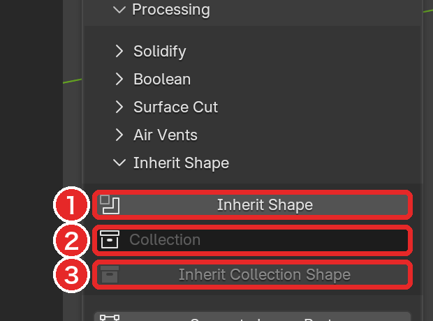
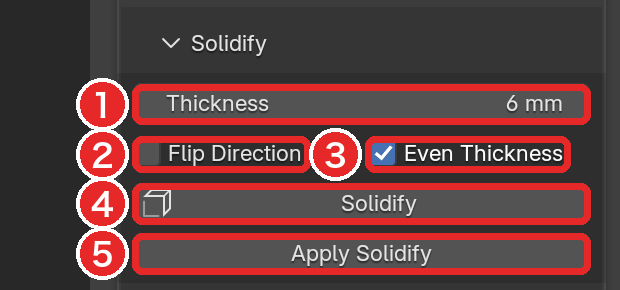
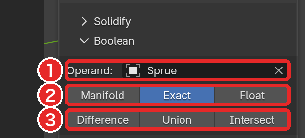
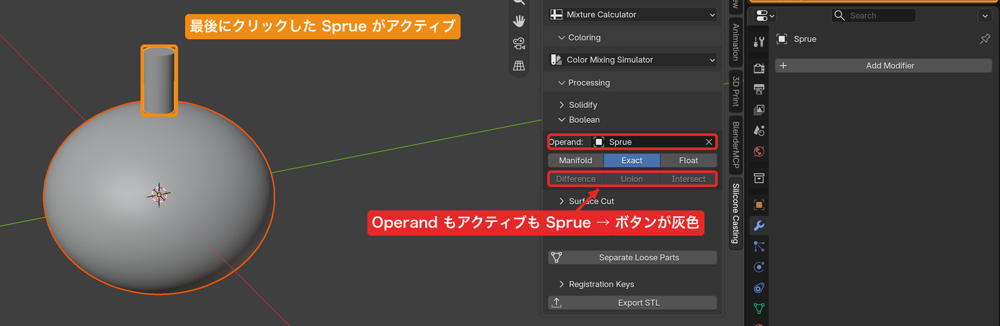

# 壁と Boolean（Inherit Shape / Solidify / Boolean）

[README に戻る](../README.md)

## 📝 TL;DR

- **Inherit Shape** で、マスターを残したまま同じ形のオブジェクト（`.inherit`）を作ります
- **Solidify** で `.inherit` に外向きの壁を付けると、内側の空洞がマスターと同じ形になります
- 壁を付けた直後は `.inherit` が選択されています。**シリコーンの量はマスターを選び直して** 測りましょう
- **Boolean** は **アクティブなオブジェクト** に付きます。Operand と同じオブジェクトだとボタンが押せません
- **Inherit Shape で作ったオブジェクトに Apply Solidify は使わない** でください

## 🧭 使う場所

Processing パネルの **Inherit Shape**、**Solidify**、**Boolean** の見出しを開いて使います。

どれも Object Mode で操作します。

## 🔗 Inherit Shape

マスターそのものには手を加えずに、マスターと同じ形のオブジェクトを作ります。

型の壁は、このオブジェクトに付けます。

1. マスターをクリックしてアクティブにします。
2. **Inherit Shape**（図の 1）を押します。

すると、`<マスター名>.inherit` という新しいオブジェクトが同じ位置にできます。

**それだけが選択され、アクティブ** になります。

- 新しいオブジェクトのメッシュ自体は空です。**Inherit Shape** という Boolean（Union）モディファイアでマスターを参照しているので、マスターと同じ形に見えます。
- マスターは変わりません。後でマスターを編集すると、`.inherit` の形もそれに追従します。
- マスターを消したり移動したりすると、`.inherit` の形も消えたり動いたりします。マスターは残しておきましょう（非表示にしてもかまいません）。

### コレクションから作る

複数のメッシュを 1 つの形として扱いたいときは、それらを 1 つのコレクションに入れます。

図の 2 の欄でそのコレクションを選んで、**Inherit Collection Shape**（図の 3）を押しましょう。

コレクション内（子コレクションを含む）のすべてのメッシュを Union した形を参照するオブジェクトが、シーンの一番上のコレクションに作られます。

- コレクションには、メッシュ以外のオブジェクトを入れないでください（エラーになります）。
- シーン直下のコレクション（Scene Collection）そのものは指定できません。

## 🧱 Solidify

選択したメッシュに厚みを付けて、型の壁にします。

| 項目               | 内容                                                                                                                                             |
| ------------------ | ------------------------------------------------------------------------------------------------------------------------------------------------ |
| **Thickness**      | 壁の厚さ。シーンの長さの単位で表示されます。`3 mm` のように単位を付けて入れられます（[単位の扱い](units.md)）。                                  |
| **Flip Direction** | オフ（既定）: 面の表側（法線の向き）へ厚みを付けます。閉じたメッシュでは外側に壁ができ、内側の形は元の形のままです。オン: 内側へ厚みを付けます。 |
| **Even Thickness** | オン（既定）: 角でも指定した厚さを保ちます。                                                                                                     |

**Solidify**（図の 4）を押すと、選択中のすべてのメッシュに **Silicone Casting Solidify** という Solidify モディファイアが付きます。

- 設定を変えてもう一度押すと、同じモディファイアが新しい設定に更新されます。モディファイアが重ねて増えることはありません。
- サイドバーの値は、ボタンを押したときに読み込まれます。値を変えただけでは、付いているモディファイアは変わりません。

できた壁は、外側の面と内側の面の両方を持つ閉じたメッシュです。

マスターの形を参照する `.inherit` に外向きの壁を付けると、内側の空洞がマスターと同じ形になります。

### 型の壁を作る手順

マスターを残したまま壁を作り、その後にシリコーンと樹脂の量を測るまでの流れです。

各手順で、**どのオブジェクトが選択・アクティブになっているか** に注目しましょう。

| 手順 | 操作                                                                            | 操作する時点で選択・アクティブなもの          | 結果                                                        |
| ---- | ------------------------------------------------------------------------------- | --------------------------------------------- | ----------------------------------------------------------- |
| 1    | **Inherit Shape** を押す                                                        | マスター（クリックしてアクティブにしておく）  | `<マスター名>.inherit` ができ、選択・アクティブがそれに移る |
| 2    | **Thickness** を入れ、**Flip Direction** をオフにして **Solidify** を押す       | `.inherit`（手順 1 で自動的に選択されたまま） | `.inherit` に外向きの壁が付く。マスターは変わらない         |
| 3    | シリコーンの量を測る: マスターをクリックして選び直し、**Measure Volume** を押す | マスター                                      | マスターの体積 = 型の空洞 = 必要なシリコーンの量            |
| 4    | （必要なら）樹脂の量を測る: `.inherit` だけを選び、**Measure Volume** を押す    | `.inherit`                                    | 壁だけの体積 = 印刷する樹脂の量                             |

> ⚠️ **注意**: 手順 2 の後にそのまま Measure Volume を押すと、選択されている `.inherit`（壁）が測られます。
> シリコーンの量が知りたいときは、必ず手順 3 のようにマスターを選び直しましょう（[何を測るか](measurement.md#%E4%BD%95%E3%82%92%E6%B8%AC%E3%82%8B%E3%81%8B)）。

マスターに直接 Solidify を付けると、マスター自体が壁になります。

すると、シリコーンの量を測るためのマスターの体積が得られなくなります。

### Apply Solidify

**Apply Solidify**（図の 5）は、選択中のメッシュから **Silicone Casting Solidify だけ** をメッシュに焼き込み、そのモディファイアを外します。

焼き込みはオブジェクト自身のメッシュに対して行い、他のモディファイアの効果は含めません。他のモディファイアはそのまま残ります。

> ⚠️ **注意**: **Inherit Shape で作ったオブジェクトには使わないでください。**
> 自身のメッシュが空なので、焼き込んだ結果も空になります。壁が消えて、マスターの形だけに戻ってしまいます。
> その場合は **Ctrl+Z** で戻しましょう。

形をまとめて確定したいときは、[Separate Loose Parts](surface-cut.md#-separate-loose-parts) を使いましょう。すべてのモディファイアを適用したコピーを作ります。

ほかのオブジェクトとメッシュを共有しているオブジェクトには、Apply Solidify は使えません（警告が出ます）。

## ➖ Boolean

型から注ぎ口の円柱をくり抜く、といった加工に使います。

| 項目                                       | 内容                                                                                                                                                        |
| ------------------------------------------ | ----------------------------------------------------------------------------------------------------------------------------------------------------------- |
| **Operand**                                | 加工に使う **別の** メッシュ（くり抜く形、足す形）。メッシュだけが選べます。                                                                                |
| **Solver**                                 | 計算方法。**Manifold**（閉じたメッシュ向けで最も速い）、**Exact**（既定。重なりや同一平面の形に強い）、**Float**（単純で速いが重なった形に弱い）            |
| **Difference** / **Union** / **Intersect** | 押したボタンの演算の Boolean モディファイアを追加します。Difference はアクティブから Operand を引き、Union は足し、Intersect は重なった部分だけを残します。 |

Boolean モディファイアは、**アクティブなオブジェクト** に付きます。

Operand のオブジェクトは変わりません。

1. 加工される型をクリックしてアクティブにします。
2. **Operand** に、くり抜く形などのメッシュを指定します。
3. **Difference** などを押します。押すたびに、モディファイアが 1 つ追加されます。

### ボタンが押せないとき

次のどれかに当てはまると、3 つのボタンは灰色になります。

- Object Mode ではない
- アクティブなオブジェクトがメッシュでない、または選択されていない
- **Operand** が空
- **アクティブなオブジェクトと Operand が同じ**

複数のオブジェクトを Shift+クリックで選ぶと、**最後にクリックしたもの** がアクティブになります。

Operand にするオブジェクトを最後にクリックすると、アクティブと Operand が同じになって、ボタンが押せません。

加工される型を最後にクリックしましょう。

### ⚠️ 注意

- **Operand** の欄は、Surface Cut の欄の一番上にある Operand と **同じ設定** です。片方で変えると、もう片方も変わります。
- Operand に使ったオブジェクトは、そのままシーンに残って表示されます。見えていると邪魔な場合は、非表示にしましょう（非表示にしても Boolean は効きます）。
- STL 出力や体積計測のときは、Operand のオブジェクトを選択に含めないよう注意しましょう。
