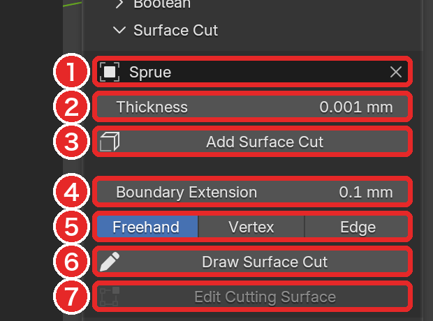
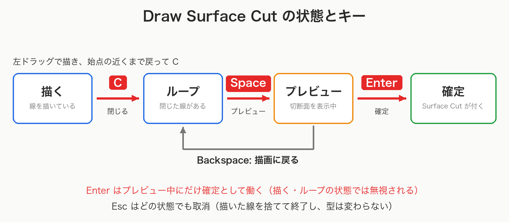
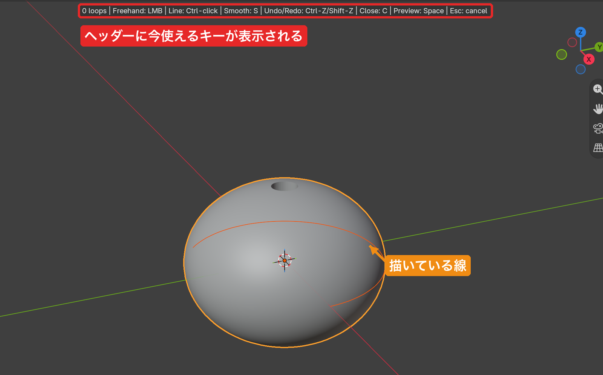
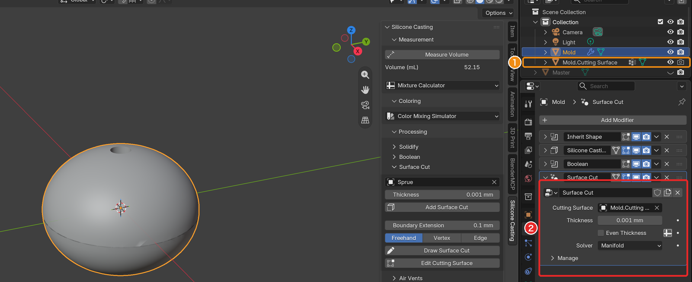
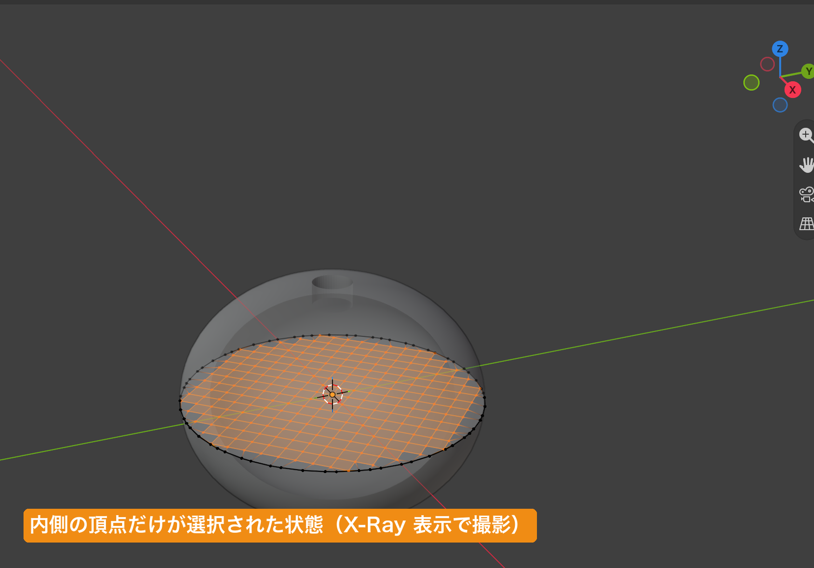
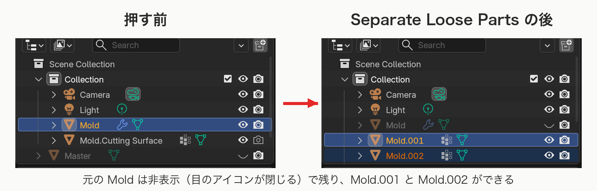

# 型の分割（Surface Cut / Separate Loose Parts）

[README に戻る](../README.md)

## 📝 TL;DR

- 型を割る作業は **Surface Cut → Separate Loose Parts** の 2 段階
- Surface Cut を付けただけでは、形が割れて見えても **オブジェクトは 1 つのまま**
- Draw Surface Cut は **描く → C で閉じる → Space でプレビュー → Enter で確定** の順。線を始点まで戻しただけでは **ループは閉じない**
- Thickness の既定値は 0.001 mm で、**切断の幅はほぼ 0**。必要に応じて設定する
- Separate Loose Parts は、**ビューポート表示をオフにしたものも含めて** すべてのモディファイアを適用する。元のオブジェクトは非表示で残る

## 🧭 2 段階で割る

型を割る作業は 2 段階。

1. **Surface Cut** で、型に「切断面に沿って薄く削る」モディファイアを付ける。この時点では、形は割れて見えても **オブジェクトは 1 つのまま**。
2. **Separate Loose Parts** で、離れた塊をそれぞれ別のオブジェクトにする。

## 🔪 Surface Cut モディファイア

Surface Cut は、切断面のメッシュを法線に沿って **Thickness** の厚さだけ押し出して板にし、その板を型から引く（Difference）。

型には、1 つの **Surface Cut** モディファイアとして付く。

- 切断面のオブジェクトは参照されるだけで、変更されない。切断面を後から編集すると、切断もその場で更新される。
- 作った後でも、モディファイアの欄で **Cutting Surface**（切断面のオブジェクト）、**Thickness**、**Even Thickness**（既定はオフ）、**Solver**（**Manifold** が既定、**Exact** も選べる）を変えられる。

> ⚠️ **注意**: **Thickness** の既定値は、入力できる最小値の 0.001 mm。切断の幅はほぼ 0 になる。
> すき間が必要なら、作る前に Thickness を設定するか、作った後にモディファイアの Thickness を変える。

Surface Cut の付け方は 2 通り。

| 方法                 | 使うとき                                     |
| -------------------- | -------------------------------------------- |
| **Add Surface Cut**  | 切断面にするメッシュを自分で用意したとき     |
| **Draw Surface Cut** | 型の表面に線を描いて、切断面を作らせたいとき |

## 📎 Add Surface Cut

1. 割る型をクリックしてアクティブにする（選択された状態にする）。
2. 欄の一番上の **Operand**（図の 1）に、切断面にするメッシュを指定する。型とは別のメッシュでなければならない。
3. **Thickness**（図の 2）を確認して、**Add Surface Cut**（図の 3）を押す。

ボタンが押せる条件は、[Boolean](shell.md#%E3%83%9C%E3%82%BF%E3%83%B3%E3%81%8C%E6%8A%BC%E3%81%9B%E3%81%AA%E3%81%84%E3%81%A8%E3%81%8D) と同じ。アクティブと Operand が同じだと押せない。

> ⚠️ **注意**: この **Operand** は、Boolean の欄の Operand と同じ設定。片方で変えると、もう片方も変わる。

## ✏️ Draw Surface Cut

型の表面に閉じた線（ループ）を描くと、そのループを縁とする曲面の切断面が自動で作られる。

### 始める前に

- 割る型を **アクティブ** にする。線は、アクティブなメッシュの表面（モディファイアを含めた見た目の形）に描く。形は、描き始めた時点のものが使われる。
- 3D ビューを 4 分割表示（Quad View）にしていると始められない。1 画面の 3D ビューで使う。
- Air Vents の描画中は始められない。先に確定か取消をする。
- **Boundary Extension**（図の 4）: 作られる切断面を、描いた縁より外側へこの長さだけ延ばす。延ばすことで、切断面が型の表面を確実に突き抜ける。既定は 0.1 mm で、0 にすると延長しない。描画中も変更でき、プレビューに反映される。すでに確定した切断面には影響しない。
- **Input**（図の 5）: 線の入れ方を **Freehand**（自由に描く）、**Vertex**（頂点をクリック）、**Edge**（辺をクリック）から選ぶ。描画中も切り替えられる。

**Draw Surface Cut**（図の 6）を押すと、描画が始まる。

3D ビューのヘッダーに、今使えるキーが表示される。

### 描画の流れ

描画には「描く」「プレビュー」の 2 つの状態がある。

**Enter で確定できるのは、プレビューのときだけ**。

1. 型の表面を **左ドラッグ** して線を描く。途中でマウスを離して視点を回し、線の末端の近くから描き続けられる。

2. 線を始点の近くまで戻したら、**C** を押してループを閉じる。始点から離れていると閉じられない（ヘッダーに案内が出る）。

   > ⚠️ **注意**: 線を始点まで戻してマウスを離しただけでは、ループは閉じない。**C** を押して、はじめて閉じたループになる。

3. 中空の形などで内側にもう 1 本ループが要るときは、同じように描いて **C** で閉じる。

4. **Space** を押すと、切断面が作られてプレビュー表示になる。閉じていない線が残っていると、プレビューに進めない。

5. プレビューを確認して **Enter** を押すと、確定する。

### 描画中のキー

| キー                                               | 動作                                                                                                                       |
| -------------------------------------------------- | -------------------------------------------------------------------------------------------------------------------------- |
| 左ドラッグ                                         | 線を描く（Freehand）。マウスが型から外れると線は止まり、末端の近くから再開できる。離れた場所へ飛んで続けることはできない。 |
| **Ctrl** + 左クリック                              | 線の末端からクリックした位置まで、画面上の直線を表面に投影した線を足す（Freehand）                                         |
| 左クリック                                         | Vertex: 近くの見えている頂点に合わせて線をつなぐ。Edge: 見えている辺を線につなぐ                                           |
| **Alt** + 左クリック                               | Edge: 四角面の辺のループをまとめて足す                                                                                     |
| **Ctrl** + 左クリック                              | Edge: 線の末端からクリックした辺まで、最短の辺の経路を足す                                                                 |
| **S**                                              | 描きかけの線（なければ最後に閉じたループ）を滑らかにする。押すほど滑らかになる。                                           |
| **C**                                              | 描きかけの線を閉じてループにする                                                                                           |
| **Space**                                          | 切断面をプレビューする                                                                                                     |
| **Enter**                                          | プレビュー中のとき、確定する                                                                                               |
| **Backspace**                                      | プレビュー中: 描画に戻る。描画中: 描きかけの線を消す。描きかけの線がなければ、最後に閉じたループを開き直す                 |
| **Ctrl+Z** / **Ctrl+Shift+Z**（または **Ctrl+Y**） | 描画中の取り消し / やり直し（macOS では Cmd も使える）                                                                     |
| **Esc**                                            | 取消。描いた線とプレビューをすべて捨てて終了する。型は何も変わらない。                                                     |

> ⚠️ **注意**: ヘッダーには `Undo/Redo: Ctrl-Z/Shift-Z` と表示される。
> 実際のやり直しは **Ctrl+Shift+Z**（Ctrl と Shift を押しながら Z）。Shift+Z だけでは何も起きない。

視点の操作と、**N** / **T** によるサイドバー・ツールバーの開閉は、描画中もそのまま使える。

視点の操作とは、中ボタンドラッグでの回転、ホイールでのズーム、テンキーの 1 / 3 / 7（Ctrl との組み合わせも可）、画面右上のナビゲーションギズモのこと。

視点を変えても、線は変わらない。

描けるのは、1 本の外側のループと、その内側の穴のループ。

投影して交差・接触するループや、外側のループが 2 本ある場合は、プレビューのときにエラーが表示される。その場合は描き直す。

### 確定した後

- アクティブだった型に、**Surface Cut** モディファイアが 1 つ付く。
- 切断面は `<型の名前>.Cutting Surface` という別のオブジェクトとしてシーンに残り、モディファイアから参照される。
- 型はまだ 1 つのオブジェクト。続けて [Separate Loose Parts](#-separate-loose-parts) で分ける。

> ⚠️ **注意**: 切断面のオブジェクトは、閉じていない面。
> 全選択して Measure Volume を押すと、この面でエラーになる。
> 全選択して Export STL を押すと、STL に混ざる。

## 🪄 Edit Cutting Surface

描いて作った切断面の、内側の曲がり方を手で調整する。

1. Surface Cut を付けた型（または切断面そのもの）をアクティブにする。
2. **Edit Cutting Surface**（図の 7）を押す。

切断面が Edit Mode で開き、**縁以外の内側の頂点だけ** が選択された状態になる。

内側は頂点グループ **Cut Interior** に、縁は **Cut Boundary** に入っている。

**G** などで頂点を動かすと、型の切断がその場で更新される。

終わったら、**Tab** で Object Mode に戻る。

## 🧩 Separate Loose Parts

選択中のメッシュを、離れた塊ごとに別のオブジェクトにする。

Processing パネルの中ほどにある、常に表示されたボタン。

1. 割った型を選択する（複数可）。
2. **Separate Loose Parts** を押す。

押すと、次のようになる。

- 元のオブジェクトの **すべてのモディファイアを適用したコピー** が作られ、塊ごとに別オブジェクトに分けられる。
- 新しいパーツは、元と同じコレクションに入る。モディファイアは持たない（形は焼き込み済み）。オブジェクトに割り当てたマテリアルも引き継ぐ。
- 元のオブジェクトは削除されない。メッシュとモディファイアもそのままで、**非表示** になり、選択も外れる。
- 押した後は、**新しくできたパーツがすべて選択** され、そのうち最初のパーツがアクティブになる。

> ⚠️ **注意**: Separate Loose Parts は、**ビューポート表示（モニターのアイコン）をオフにしたモディファイアも適用する**。
> 画面で見えていないモディファイアの効果も、パーツに焼き込まれる。

表示をオフにしたモディファイアの扱いは、機能ごとに違う。

| 機能                     | 表示をオフにしたモディファイア                                                                  |
| ------------------------ | ----------------------------------------------------------------------------------------------- |
| **Separate Loose Parts** | 表示のオン・オフに関係なく、**すべて適用する**                                                  |
| **Measure Volume**       | ビューポート表示がオフなら **含めない**                                                         |
| **Export STL**           | レンダー表示（カメラのアイコン）がオフなら **含めない**。ビューポート表示のオン・オフは関係ない |

やり直すときは、パーツを削除し、Outliner の目のアイコンで元のオブジェクトを表示し直す。

> ⚠️ **注意**: このまま Export STL を押すと、全パーツが 1 つの STL に入る。
> パーツごとの出力は、[STL 出力](export-stl.md) を参照。
