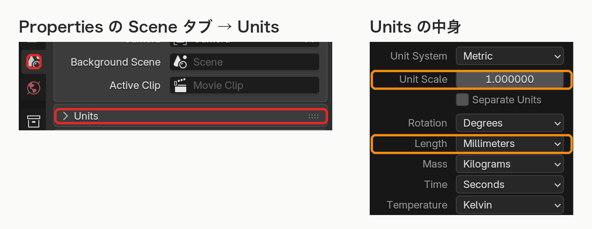

# 単位の扱い

[README に戻る](../README.md)

## 📏 長さ

次の欄は、シーンの長さの単位（**Scene Properties > Units** の **Length**）で表示される。

- Solidify の **Thickness**
- Surface Cut の **Thickness** と **Boundary Extension**
- Air Vents の **Diameter**
- Registration Keys の寸法

入力は `3 mm`、`0.5 cm` のように **単位を付ける** と確実。

値は内部では **mm の実寸** で保存される。**Unit Scale** を後から変えても実寸は変わらず、表示だけが換算される。

## 🧪 体積と重量

- 体積は mL（= cm³）、重量は g
- Measure Volume は Unit Scale を考慮した実寸の体積を出す

## 📤 STL

STL には単位の情報がないので、**mm の数値** で書き出す。

STL の数値 = Blender の座標の値 × Unit Scale × 1000（既定の Unit Scale 1.0 では座標の 1000 倍）。

詳しくは [STL 出力](export-stl.md) を参照。
