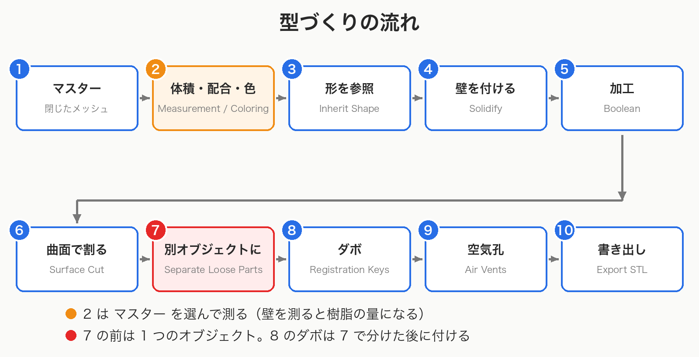
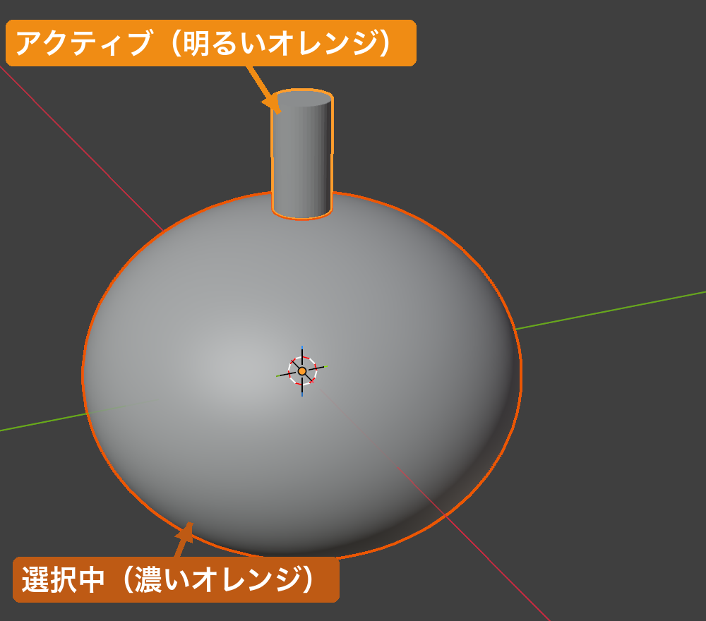

# 型づくりの流れ

[README に戻る](../README.md)

## 📝 TL;DR

- ボタンには、選択中のすべてに効くものと、**アクティブなオブジェクトだけ** に効くものがあります
- 手順ごとに、何を選択・アクティブにするかを下の表にまとめました
- **ダボは分離の後** に付けます
- シリコーンの量は **マスター** で測りましょう
- 処理の材料になったオブジェクトはシーンに残るので、**全選択には注意** です

## 🗺️ 全体の流れ

マスターモデルから、印刷できる 2 つ割りの型を作るまでの流れです。

どの手順も **Object Mode** で行います。

## 🎯 選択とアクティブ

このアドオンのボタンは 2 種類に分かれます。

選択中のオブジェクトすべてに効くものと、**アクティブなオブジェクト** だけに効くものです。

アクティブなオブジェクトは、最後にクリックしたオブジェクトです。

3D ビューでは明るいオレンジの輪郭で表示されます。Outliner では名前が明るく表示されます。

ボタンが灰色で押せないときは、まず選択とアクティブを確認しましょう。

## 🔁 手順ごとの対象

| 手順 | 使う機能                                                     | 選択・アクティブにするもの                            | 結果                                                       |
| ---- | ------------------------------------------------------------ | ----------------------------------------------------- | ---------------------------------------------------------- |
| 1    | （準備）                                                     | —                                                     | マスターは閉じたメッシュにしておく                         |
| 2    | Measure Volume → Mixture Calculator → Color Mixing Simulator | マスターを選択                                        | シリコーンの量・配合・色                                   |
| 3    | Inherit Shape                                                | マスターをアクティブ                                  | `<マスター名>.inherit` ができ、それが選択される            |
| 4    | Solidify                                                     | `.inherit` のオブジェクトを選択                       | 壁（型の本体）                                             |
| 5    | Boolean                                                      | 加工される型をアクティブ、Operand に別のメッシュ      | 型に Boolean モディファイア                                |
| 6    | Surface Cut / Draw Surface Cut                               | 割る型をアクティブ                                    | 型に Surface Cut モディファイア（まだ 1 つのオブジェクト） |
| 7    | Separate Loose Parts                                         | 割った型を選択                                        | 塊ごとの別オブジェクト（元は非表示で残る）                 |
| 8    | Registration Keys                                            | ピンが突き出す半分をアクティブ、穴が開く半分を Socket | 両方にダボ用の Boolean                                     |
| 9    | Air Vents                                                    | 穴を開ける型をすべて選択                              | 選択した型すべてに空気孔の Boolean                         |
| 10   | Export STL                                                   | 書き出すパーツだけを選択                              | mm 単位の STL                                              |

## 💡 順序が決まっている理由

### ダボ（手順 8）は分離（手順 7）の後

Registration Keys は、凸を付ける型と凹を付ける型が **別々のオブジェクト** であることを前提にしています。

Surface Cut を付けただけでは、形が 2 つに分かれて見えても **1 つのオブジェクトのまま** です。

### 分離すると、それまでのモディファイアはすべて焼き込まれる

Separate Loose Parts が作るパーツは、元のオブジェクトの全モディファイアを適用した独立したメッシュです。

ビューポート表示をオフにしたモディファイアも、適用されます。

分離した後に、元のオブジェクト（非表示で残る）へ加えた変更は、パーツには届きません。

分離後の加工は、パーツに対して行いましょう。

### 体積はマスターで測る

シリコーンが入るのは型の空洞で、空洞の形はマスターと同じです。

壁を付けたオブジェクトを測ると、壁そのもの（樹脂）の体積になります。

詳しくは [計測と配合](measurement.md#%E4%BD%95%E3%82%92%E6%B8%AC%E3%82%8B%E3%81%8B) を見てください。

## 📚 各手順の詳細

- 手順 2: [計測と配合](measurement.md)、[着色](coloring.md)
- 手順 3〜5: [壁と Boolean](shell.md)
- 手順 6〜7: [型の分割](surface-cut.md)
- 手順 8: [ダボ](registration-keys.md)
- 手順 9: [空気孔](air-vents.md)
- 手順 10: [STL 出力](export-stl.md)

## ⚠️ 作業中に残るオブジェクト

いくつかの機能は、処理の材料になったオブジェクトをシーンに残します。

- Boolean の **Operand** に使ったメッシュ
- Draw Surface Cut で描いた切断面（`<型の名前>.Cutting Surface`。閉じていない面）
- Air Vents の管（`<型の名前>.Air Vents`。ワイヤー表示）
- Separate Loose Parts の元のオブジェクト（非表示）

> ⚠️ **注意**: **A** キーで全選択すると、表示されているこれらも選択に入ります。
> そのまま Measure Volume を押すと、閉じていない切断面でエラーになります。
> Export STL を押すと、STL に混ざります。

計測や出力の前には、必要なオブジェクトだけが選択されているか確認しましょう。
